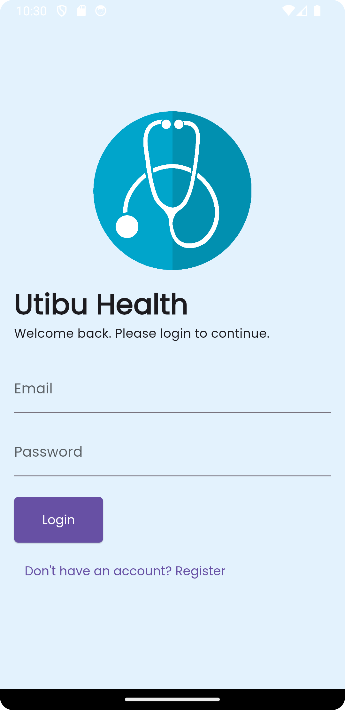
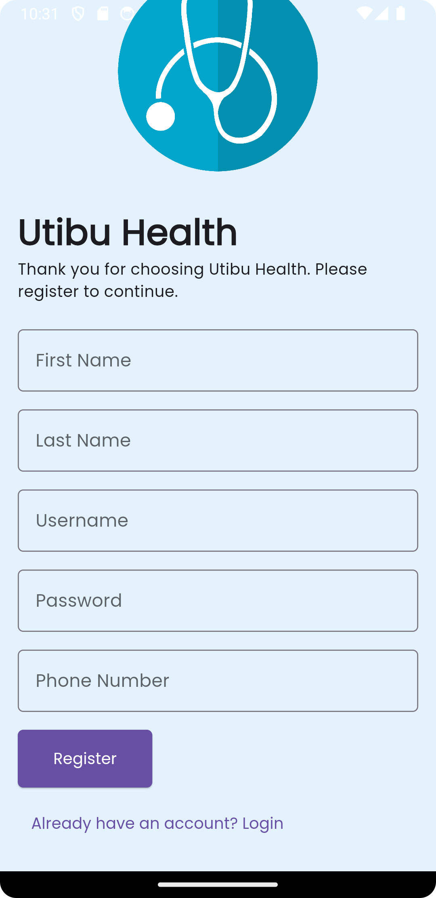
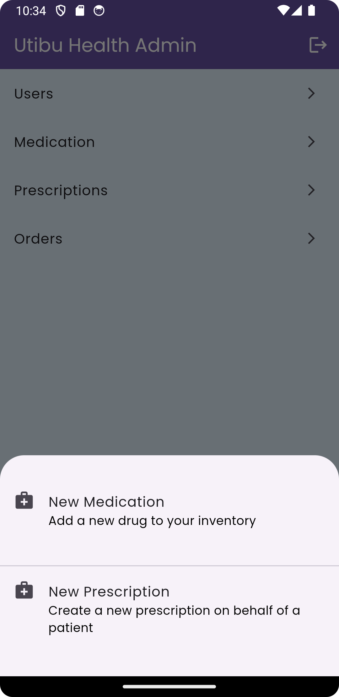
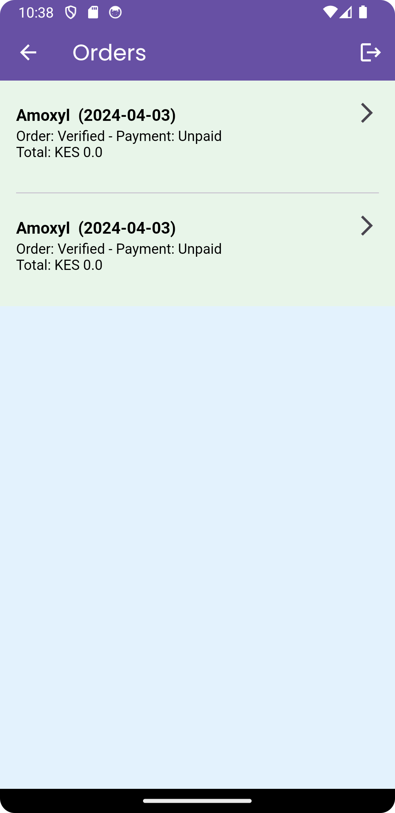
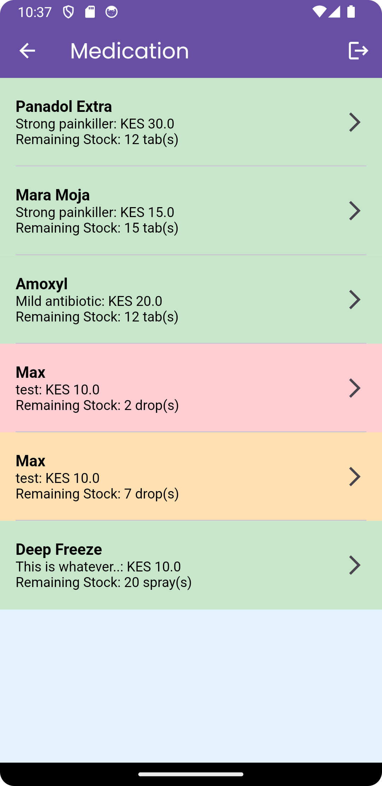
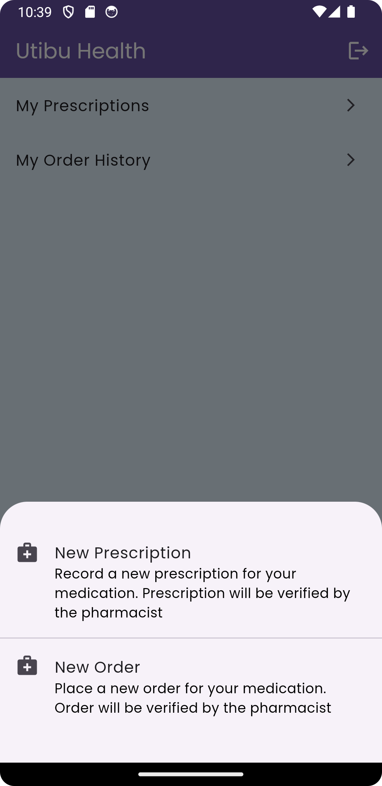
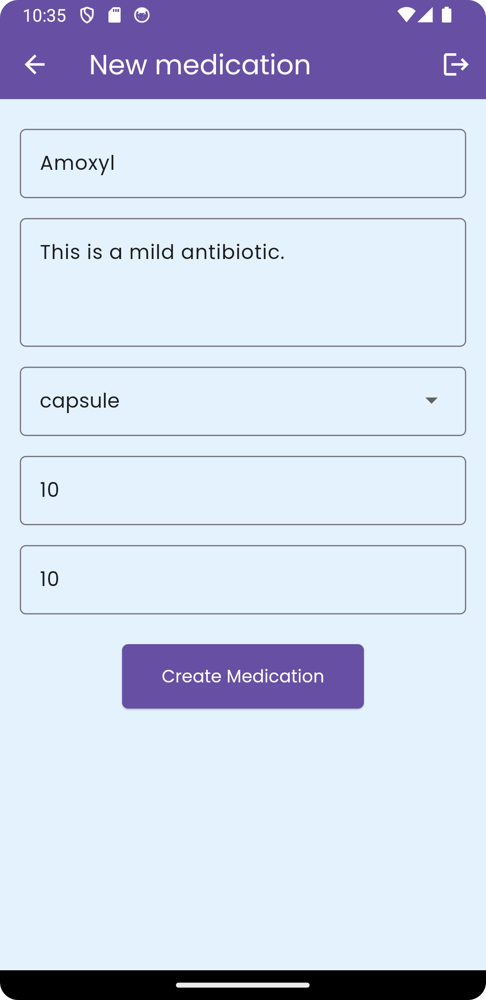
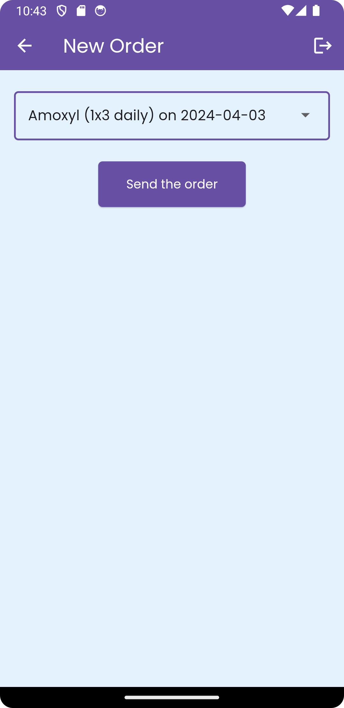

Utibu Health Mobile App
=======================

This repository contains the source code for the Utibu Health mobile app, a remote medication
ordering system for patients with chronic conditions. The app is built using Flutter for the
frontend and Node.js, Express, and Sequelize for the backend.

Table of Contents
-----------------
<!-- TOC -->
* [Utibu Health Mobile App](#utibu-health-mobile-app)
  * [Table of Contents](#table-of-contents)
  * [Installation](#installation)
  * [Usage](#usage)
  * [Architecture](#architecture)
    * [Components](#components)
    * [Patient Workflow](#patient-workflow)
    * [Pharmacist Workflow (besides the legacy system)](#pharmacist-workflow-besides-the-legacy-system)
  * [Contributing](#contributing)
  * [Screenshots](#screenshots)
  * [License](#license)
<!-- TOC -->

Installation
------------

To install and run the app locally, follow these steps:

1. Clone the frontend repository: git clone https://github.com/murageh/utibu_health_app.git
2. Clone the backend repository: git clone https://github.com/murageh/utibu_health_backend.git
3. Navigate to the backend directory: `cd utibu-health/backend` _(be sure to replace the folder
   name)_
4. Install the dependencies: `npm install`
5. Set up the database by creating an environment file `.env` file with your Microsoft SQL Server
   credentials. There is an `.env.example` file that you can use as a template.
6. Run the backend server: `npm start`
7. Navigate to the frontend directory: `cd ../frontend` _(be sure to match your folder structure)_
8. Create a `.env` file in the root of the frontend directory with the following content:

```
API_URL=http://localhost:3000 // or your local backend server URL
```

9. Install the dependencies: `flutter pub get`
10. Run the app: `flutter run`

Usage
-----

The app allows patients to register, log in, view their prescription history, place new orders, and
view their statement. The pharmacist can view and manage incoming orders in the legacy system.

Architecture
------------

The app follows a standard client-server architecture. The frontend is built with Flutter and
communicates with the backend using HTTP requests. The backend is built with Node.js, Express, and
Sequelize, and it interacts with the Microsoft SQL Server database using the `mssql` package.

### Components

- Flutter Frontend: The patient-facing app built with Flutter. It communicates with the backend to
  place orders, retrieve prescription history, and view the statement.
- Node.js Backend: The server-side application built with Node.js, Express, and Sequelize. It
  handles incoming requests from the frontend, validates and processes orders, and sends them to the
  legacy database using the `mssql` package.
- Microsoft SQL Server: The legacy database used by the pharmacy system. It stores patient
  information, medication stock, orders, invoices, and payments.

### Patient Workflow

1. The patient opens the app and logs in.
2. The patient creates or selects a prescription to refill or place a new order.
3. The frontend sends a request to the backend with the order details.
4. The backend validates the order, checks the medication stock in the legacy database, and sends a
   response to the frontend indicating success or failure.
5. If the order is successful, the backend sends the order details to the legacy database using
   the `mssql2` package.
6. The patient is notified of the order status and can choose to pay immediately or later.

### Pharmacist Workflow (besides the legacy system)

The mobile app does more than just placing orders. It also allows the pharmacist to view incoming
orders and process them in the legacy system. The pharmacist can log in to the legacy system and
view the incoming orders, process the orders, update the stock, and generate an invoice as they do
normally.

1. The pharmacist logs in to the app. The system authenticates the pharmacist and grants access to
   the pharmacist dashboard.
2. The pharmacist views the incoming orders from the patients.
3. The pharmacist can add medication(drugs), update the stock, and view a rundown of existing
   medication.
4. The pharmacist can then proceed to process the orders in the legacy system, update the stock, and
   generate an invoice for the patient.
5. The pharmacist can also see a list of all the orders that have been processed and the status of
   each order.
6. The pharmacist can also view all the users who have placed orders and their details.

Contributing
------------

Pull requests are welcome. For major changes, please open an issue first to discuss what you would
like to change.
Disclaimer: This project is a work in progress, and as such, any suggestions (and/or contributions)
are welcome.

Screenshots
-----------

|     Login Screen      |     Register Screen      |    Home Screen (Pharmacist)     |        Order Screen        |
|:---------------------:|:------------------------:|:-------------------------------:|:--------------------------:|
|  |  |  |  |

|        Medication Screen        |     Patient Home Screen      | New Medication Screen (Pharmacist) |     New Prescription Screen      |
|:-------------------------------:|:----------------------------:|:----------------------------------:|:--------------------------------:|
|  |  |      |  |

|     New Order Screen      |   |  |  |         
|:-------------------------:|---|--|--|
|  |   |  |  |

License
-------

[MIT](https://choosealicense.com/licenses/mit/)